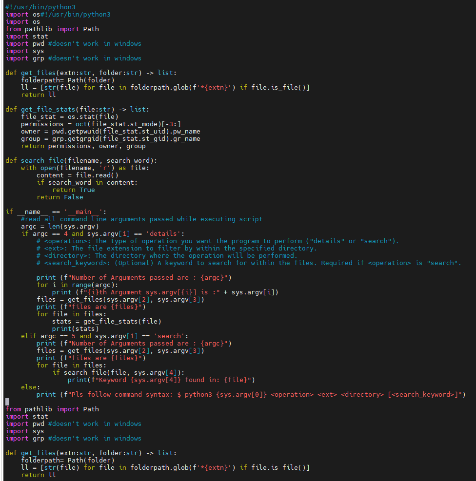

## Execution Screens





```python
# Code for assignment 4 to handle file operations like search and get details
# written by Arnav Gupta
# this code works in Linux /Ubuntu
# for windows we need to use differenet libaries

#!/usr/bin/python3
import os
from pathlib import Path
import stat
import pwd #doesn't work in windows
import sys
import grp #doesn't work in windows

def get_files(extn:str, folder:str) -> list:
    folderpath= Path(folder)
    ll = [str(file) for file in folderpath.glob(f'*{extn}') if file.is_file()]
    return ll

def get_file_stats(file:str) -> list:
    file_stat = os.stat(file)
    permissions = oct(file_stat.st_mode)[-3:]
    owner = pwd.getpwuid(file_stat.st_uid).pw_name
    group = grp.getgrgid(file_stat.st_gid).gr_name
    return permissions, owner, group

def search_file(filename, search_word):
    with open(filename, 'r') as file:
        content = file.read()
        if search_word in content:
            return True
        return False

if __name__ == '__main__':
    #read all command line arguments passed while executing script
    argc = len(sys.argv)
    if argc == 4 and sys.argv[1] == 'details':
        # <operation>: The type of operation you want the program to perform ("details" or "search").
        # <ext>: The file extension to filter by within the specified directory.
        # <directory>: The directory where the operation will be performed.
        # <search_keyword>: (Optional) A keyword to search for within the files. Required if <operation> is "search".

        print (f"Number of Arguments passed are : {argc}")
        for i in range(argc):
            print (f"{i}th Argument sys.argv[{i}] is :" + sys.argv[i])
        files = get_files(sys.argv[2], sys.argv[3])
        print (f"files are {files}")
        for file in files:
            stats = get_file_stats(file)
            print(stats)
    elif argc == 5 and sys.argv[1] == 'search':
        print (f"Number of Arguments passed are : {argc}")
        files = get_files(sys.argv[2], sys.argv[3])
        print (f"files are {files}")
        for file in files:
            if search_file(file, sys.argv[4]):
                print(f"Keyword {sys.argv[4]} found in: {file}")
    else:
        print (f"Pls follow command syntax: $ python3 {sys.argv[0]} <operation> <ext> <directory> [<search_keyword>]")

```

## Assignment 4: File Operations
Due: Wed Jul 2, 2025 11:59pmDue: Wed Jul 2, 2025 11:59pm
Ungraded, 50 Possible Points
50 Points Possible
Attempt
Attempt 1

In Progress
NEXT UP: Submit Assignment

Unlimited Attempts Allowed
Programming Assignment 4 (Python/C)
Objective:
Write a program in Python or C that performs operations on files within a specified directory based on provided arguments.

Usage:

For Python:
$ python3 yourname_hw4.py <operation> <ext> <directory> [<search_keyword>]

For C:
$ ./yourname_hw4 <operation> <ext> <directory> [<search_keyword>]

Instructions:

<operation>: The type of operation you want the program to perform ("details" or "search").
<ext>: The file extension to filter by within the specified directory.
<directory>: The directory where the operation will be performed.
<search_keyword>: (Optional) A keyword to search for within the files. Required if <operation> is "search".
Tasks:

[25 points] A. Details Operation:
If <operation> is "details", the program will display the following details for all files with the specified extension in the given directory:
File permissions
Username of the file owner
Group name of the file owner
File name
[25 points] B. Search Operation:
If <operation> is "search", the program will search within the files with the specified extension in the given directory for the provided search keyword. It will then print the names of the files that contain the search keyword.
Examples:

Details Operation:
Suppose there are two files in the directory /home/user/documents:
- report.txt
- notes.txt
The user wants to see the details of all .txt files in that directory.
Command:
For Python: $ python3 yourname_hw3.py details .txt /home/user/documents
For C: $ ./yourname_hw3 details .txt /home/user/documents
Output:

    File: report.txt
    Permissions: 755
    Owner: user
    Group: usergroup

    File: notes.txt
    Permissions: 644
    Owner: user
    Group: usergroup
Search Operation:
In the same directory /home/user/documents with files report.txt and notes.txt, the user wants to search for the keyword "meeting" in all .txt files.
Command:
For Python: $ python3 yourname_hw3.py search .txt /home/user/documents meeting
For C: $ ./yourname_hw3 search .txt /home/user/documents meeting
Output: Keyword "meeting" found in: notes.txt

 

Helper Code:

stat_example.pyDownload stat_example.pyOpen this document with ReadSpeaker docReader

stat_example.cDownload stat_example.cOpen this document with ReadSpeaker docReader

search_example_using_syscalls.cDownload search_example_using_syscalls.cOpen this document with ReadSpeaker docReader

search_example_using_libc.cDownload search_example_using_libc.cOpen this document with ReadSpeaker docReader

search_example_python.py