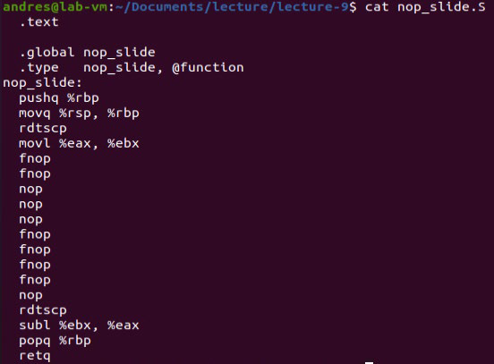

Lab Assignment 8 - Due July 21st at 11:59PM
Due: Mon Jul 21, 2025 11:59pmDue: Mon Jul 21, 2025 11:59pm
Ungraded, 10 Possible Points
10 Points Possible
Attempt
Attempt 1

In Progress
NEXT UP: Submit Assignment

Unlimited Attempts Allowed
 

EE-3233 Systems Programming for Engineers

Teaching/Lab Assistant: Kriza Baby               E-mail: kriza.baby@utsa.edu

Lab Assignment 8

In this short assignment you must code a small C program that utilizes the fork() system call to create a child process.

The child process should include the following line of code to print its information:

printf("[PID %d] Child process. Parent PID = %d.\n",

(int) getpid(), (int) getppid());

And the parent process the following line (here pid_child is a variable obtained from fork()):

printf("[PID %d] Parent process. Child PID = %d.\n",

(int) getpid(), (int) pid_child);

Expected Output

image.png

Tips/Hints You only need these headers in your code:

#include <stdio.h>

#include <unistd.h>

#include <sys/types.h>

Deliverables

You must upload

1) Script with your solution, named with the following format: Lab8_<first-name>_<last-name>.c

2) Screenshot of Output

Report-like submissions in PDF format will no longer be accepted.

Grading

•Your solution will be evaluated with a script to check if your solution is correct.

•Partial marks will be granted for cases where the output is partially correct.

 

Furthermore, following the syllabus, your script will be evaluated against a Code Similarity Checker to detect similar code and/or plagiarism.

Choose a submission type