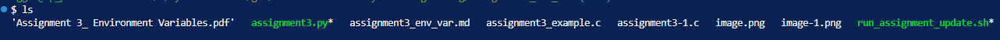
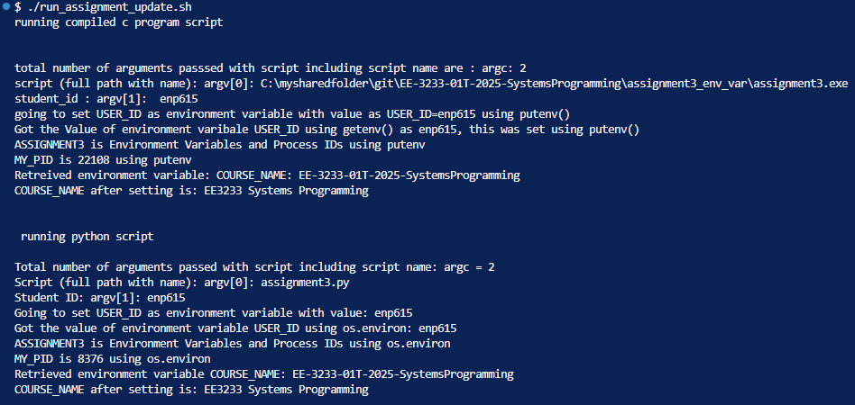
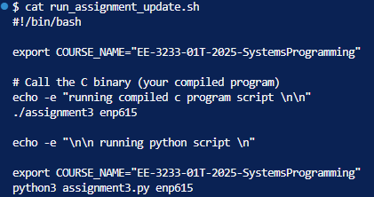
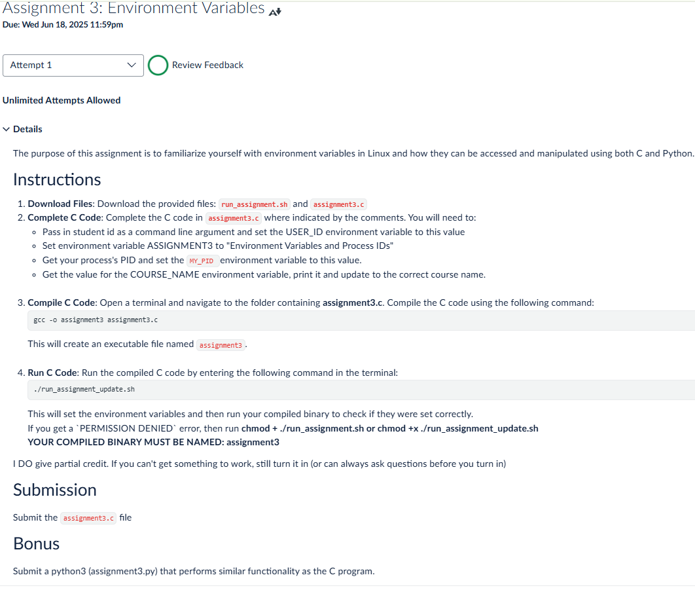
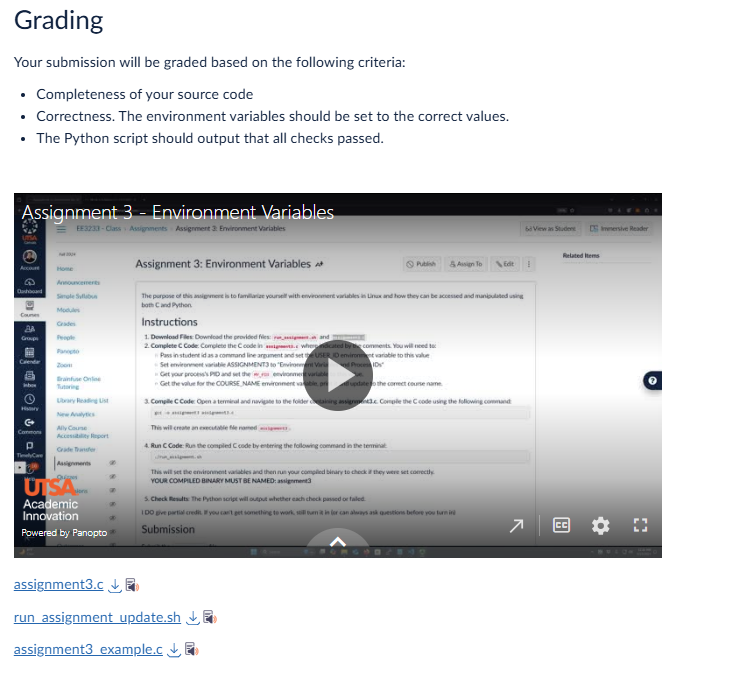

assignment3_env_var.md
## ----------------------------------------------------------------------------
# Assignment 3: Environment Variables
## Name: **Arnav Gupta**
## Utsa abcID : **Enp615**
## ----------------------------------------------------------------------------
**Abstract**: This lab is to familiarize yourself with environment variables in Linux and how they can be accessed and manipulated using both C and Python

| File                  | Description                     |
|-----------------------|---------------------------------|
| [assignment3-1.c](./assignment3-1.c) | c code to call parameters passed through command line |
| [assignment3.py](./assignment3.py) | python code to call parameters passed through command line  |
| [run_assignment_update.sh](./run_assignment_update.sh) | bash file, code to call c and python scrips  |


### Execution Steps





## Conclusion
**Conclusion**: Learnt how to pass parameters througn command line for C and pyhton programs. Major difference I found that for C, I need to compile first and then execute, But in python i was able to run directly. 

## Source Code
**Source Code**




```c

#include <stdlib.h>
#include <stdio.h>
#include <sys/types.h>
#include <unistd.h>

int main(int argc, char *argv[])
{
    // Step 1
    // Pass in your student id via command line argument.
    // grab command line arguments
    printf("total number of arguments passsed with script including script name are : argc: %d\n", argc);
    printf("script (full path with name): argv[0]: %s\n", argv[0]); // this is script name
    printf("student_id : argv[1]:  %s\n", argv[1]); // this is first argument passed in script
    
    if (argc < 2) {
        fprintf(stderr, "Usage: %s <student_id>\n", argv[0]);
        return 1;
    }

    // create a string having env var name and value 
    char user_id[100];
    snprintf(user_id, sizeof(user_id), "USER_ID=%s", argv[1]);
    printf("going to set USER_ID as environment variable with value as %s using putenv()\n", user_id);

    //set env variable
    if (putenv(user_id) != 0) {
        perror("Failed to set USER_ID");
        return 1;
    } else {
        printf("Got the Value of environment varibale USER_ID using getenv() as %s, this was set using putenv()\n", getenv("USER_ID"));
    }

    // Step 2: Set ASSIGNMENT3
    char *assignment_str = "ASSIGNMENT3=Environment Variables and Process IDs";
    if (putenv(assignment_str) != 0) {
        perror("Failed to set ASSIGNMENT3");
        return 1;
    } else {
        printf("ASSIGNMENT3 is %s using putenv\n", getenv("ASSIGNMENT3"));
    }

    // Step 3
    // Write code to get your process's ID (PID)
    // Example code to convert int to char[]
    // char pid_str[8] = {0};
    // sprintf(pid_str, "%d", <variable used for getpid>);
    // Step 3: Get PID
    pid_t pid = getpid();
 
    // Step 4
    // Set environment variable MY_PID to the PID found above
    // Print the PID
    char pid_env[50];
    snprintf(pid_env, sizeof(pid_env), "MY_PID=%d", pid);
    if (putenv(pid_env) != 0) {
        perror("Failed to set MY_PID");
        return 1;
    } else {
        printf("MY_PID is %s using putenv\n", getenv("MY_PID"));
    }
 
    // Step 5
    // An environment variable named "COURSE_NAME" is available, as its being set using EXPORT command throung shell script
    // Print the value
    // Change it to the correct course name (EE3233 Systems Programming)
    // Print it again
    // Step 5: Update COURSE_NAME
    // Assume it's already in environment
    char *course_val = getenv("COURSE_NAME");
    if (course_val)
        printf("Retreived environment variable: COURSE_NAME: %s\n", course_val);
    else
        printf("COURSE_NAME not set initially.\n");
    
    // Now set it
    char *course_str = "COURSE_NAME=EE3233 Systems Programming";
    if (putenv(course_str) != 0) {
        perror("Failed to set COURSE_NAME");
        return 1;
    } else {
        printf("COURSE_NAME after setting is: %s\n", getenv("COURSE_NAME"));
    }


    return 0;
}
```

```python

#!/usr/bin/env python3
import os
import sys

def commandline_param_passing():
    # Step 1: Pass student ID via command line
    argc = len(sys.argv)
    print(f"Total number of arguments passed with script including script name: argc = {argc}")
    print(f"Script (full path with name): argv[0]: {sys.argv[0]}")
    
    if argc < 2:
        print(f"Usage: {sys.argv[0]} <student_id>")
        return 1
    
    student_id = sys.argv[1]
    print(f"Student ID: argv[1]: {student_id}")
    
    # Set USER_ID environment variable
    os.environ['USER_ID'] = student_id
    print(f"Going to set USER_ID as environment variable with value: {student_id}")
    print(f"Got the value of environment variable USER_ID using os.environ: {os.environ.get('USER_ID')}")

    # Step 2: Set ASSIGNMENT3
    os.environ['ASSIGNMENT3'] = "Environment Variables and Process IDs"
    print(f"ASSIGNMENT3 is {os.environ.get('ASSIGNMENT3')} using os.environ")

    # Step 3: Get PID
    pid = os.getpid()

    # Step 4: Set MY_PID
    os.environ['MY_PID'] = str(pid)
    print(f"MY_PID is {os.environ.get('MY_PID')} using os.environ")

    # Step 5: Read, update, and print COURSE_NAME
    course_name = os.environ.get("COURSE_NAME")
    if course_name:
        print(f"Retrieved environment variable COURSE_NAME: {course_name}")
    else:
        print("COURSE_NAME not set initially.")

    os.environ["COURSE_NAME"] = "EE3233 Systems Programming"
    print(f"COURSE_NAME after setting is: {os.environ.get('COURSE_NAME')}")

    return 0


if __name__ == "__main__":
    commandline_param_passing()

```

## Annexure: Assignment 3: Environment Variables
Due: Wed Jun 18, 2025 11:59pmDue: Wed Jun 18, 2025 11:59pm
Ungraded, 20 Possible Points
20 Points Possible
Attempt
Attempt 1

Review Feedback
Offline Score:
N/A

Unlimited Attempts Allowed
The purpose of this assignment is to familiarize yourself with environment variables in Linux and how they can be accessed and manipulated using both C and Python.

Instructions
Download Files: Download the provided files: run_assignment.sh and assignment3.c
Complete C Code: Complete the C code in assignment3.c where indicated by the comments. You will need to:
Pass in student id as a command line argument and set the USER_ID environment variable to this value
Set environment variable ASSIGNMENT3 to "Environment Variables and Process IDs"
Get your process's PID and set the MY_PID environment variable to this value.
Get the value for the COURSE_NAME environment variable, print it and update to the correct course name.

Compile C Code: Open a terminal and navigate to the folder containing assignment3.c. Compile the C code using the following command:
gcc -o assignment3 assignment3.c
This will create an executable file named assignment3.

Run C Code: Run the compiled C code by entering the following command in the terminal:
./run_assignment_update.sh
This will set the environment variables and then run your compiled binary to check if they were set correctly.
If you get a `PERMISSION DENIED` error, then run chmod + ./run_assignment.sh or chmod +x ./run_assignment_update.sh
YOUR COMPILED BINARY MUST BE NAMED: assignment3
I DO give partial credit. If you can't get something to work, still turn it in (or can always ask questions before you turn in)

Submission
Submit the assignment3.c file

Bonus
Submit a python3 (assignment3.py) that performs similar functionality as the C program.

Grading
Your submission will be graded based on the following criteria:

Completeness of your source code
Correctness. The environment variables should be set to the correct values.
The Python script should output that all checks passed.



