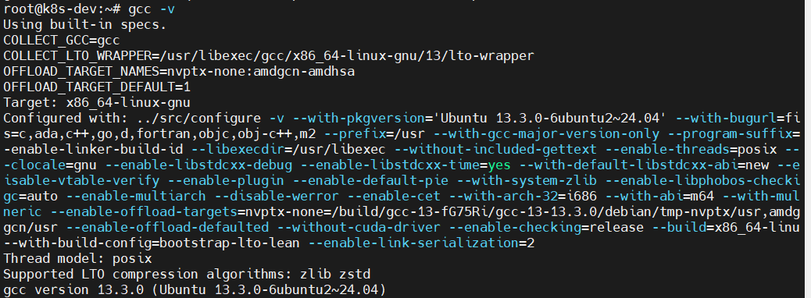
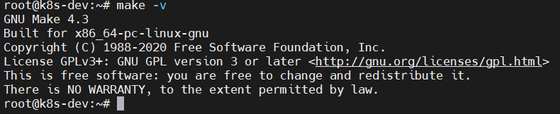
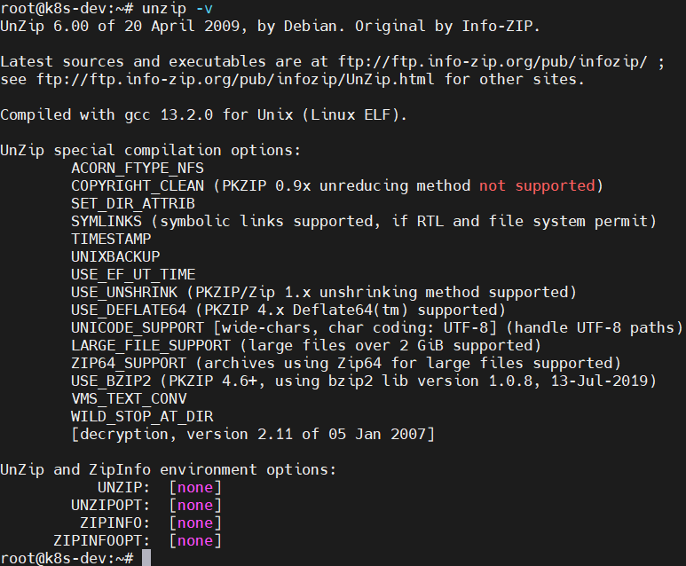
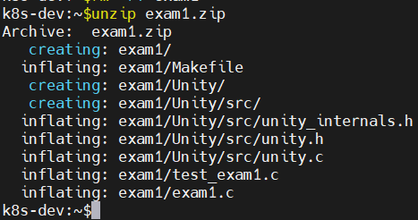

# EE-3233-01T-Summer 2025-Systems Programming for Engineers
## ----------------------------------------------------------------------------
# Assignment 2: multiple_copies
## Name: **Arnav Gupta**
## Utsa abcID : **Enp615**

### Developer Machine Setup : vscode for c/c++ on ubuntu
=============================
- Install VSCode
- sudo apt update -y && sudo apt upgrade -y
- sudo apt install build-essential

