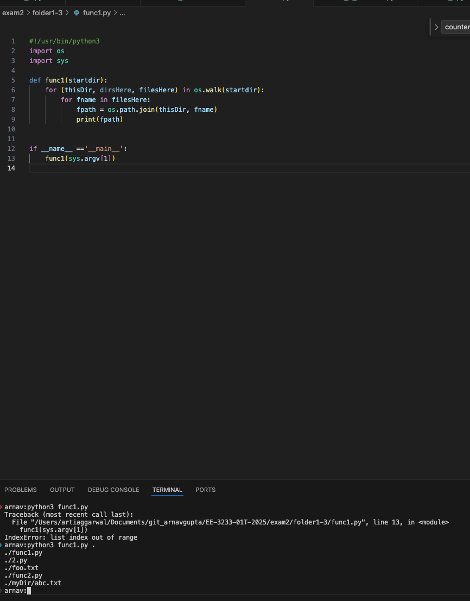
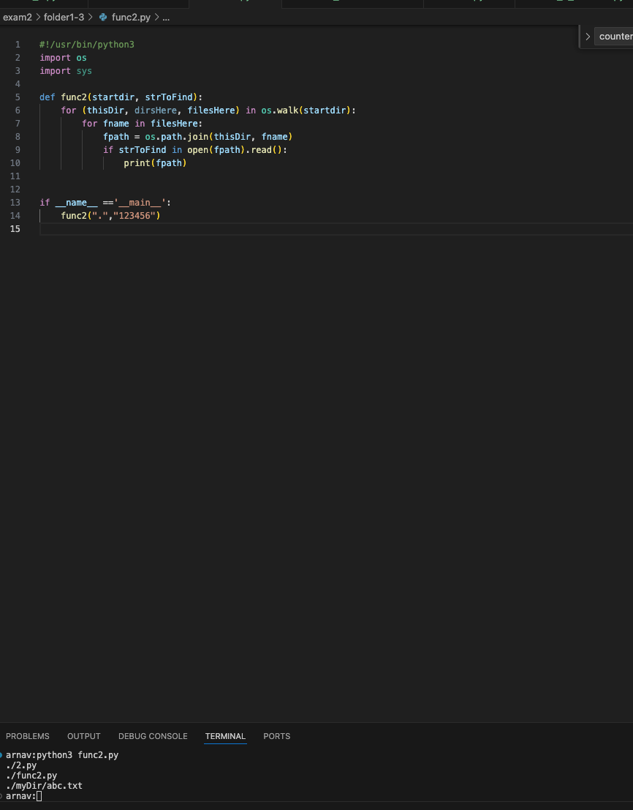
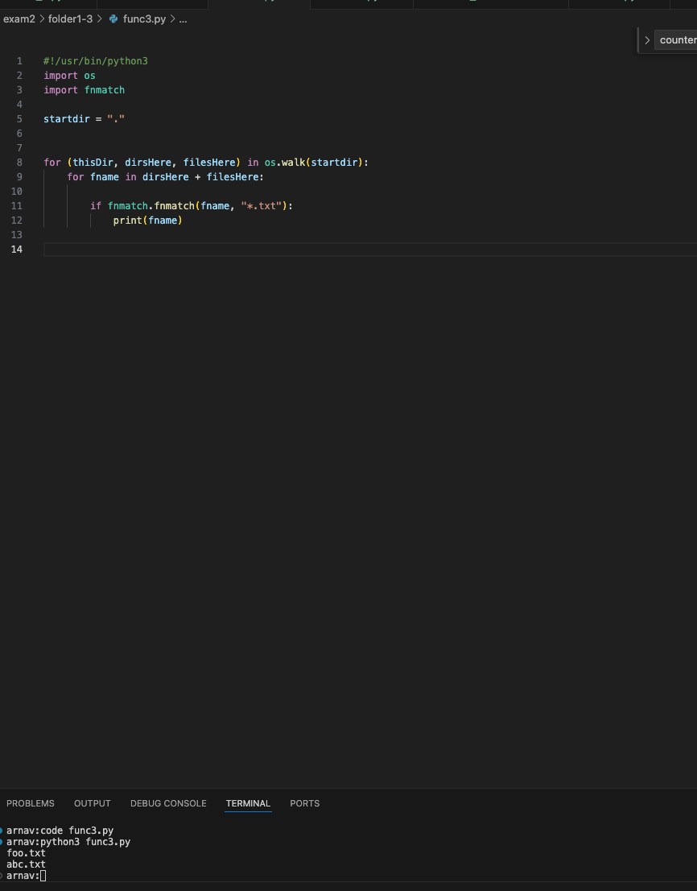

Exam 2
Due: Sun Jul 20, 2025 11:59pmDue: Sun Jul 20, 2025 11:59pm
Ungraded, 130 Possible Points
130 Points Possible
Attempt
Attempt 1

Review Feedback
Offline Score:
N/A

Unlimited Attempts Allowed
Questions 1-3 tend to get the most questions so providing some extra instructions

The provided bash commands are hints to assist with solving.

ls -al, this is a list of files/folders in the current directory. (Pay attention to the file/folder names)
ls -al myDir, this is the contents of a specific directory (myDir)
grep -r 123456 *, this searches for the string 123456 in any file that's in the current directly and subdirectories (recursively)
Problem 1. This is takes an argument from the user and was executed using the following command python3 func1.py . (the . is part of the execution). Remember the . in Linux is the current directory. The problem gives a list of outputs, what output makes the most sense given the code for func1.

Problem 2. func2 is similar, what's the output? Python is pretty verbose, I tried to use variable names that give hints.

Problem 3. Again similar to 1 and 2, what's the expected output given the current directory

 

Feel free to ask any questions!

EE3233_exam2_Summer_2025.pdfOpen this document with ReadSpeaker docReader

 

Exam 2: Code submission clarification

Your code should take command 1 line argument, that would the desired pid_max to use.
Compile your program: gcc exam2.c -o exam2
Example usage: sudo ./exam2 4000000
Following that example usage, argv[1] in your code would be "4000000" (yes it's a string and that's okay)
Now that's you have the read in command line argument, you need to use to update your system. Using fork, to spawn off a child process, remember that the parent will continue to run so you need to have it wait until the child process has finished. You can use waitpid or wait, or less eloquently, just wait a certain amount of time until the child process
Reads the current value from /proc/sys/kernel/pid_max
Prints the current value
Updates the value with argv[1]. The child process is now done and can exit.
Now that the child process is finished. The parent process can continue. If you used wait or waitpid, the exit from the child process will trigger the parent to continue. The parent process should now read the value from /proc/sys/kernel/pid_max and print it. It should max the value from argv[1].
Make sure you're handling errors on all your functions.

TLDR:

Capture argv[1]
fork (ensure parent process waits for child process to finish)
In the child, process, print current value from /proc/sys/kernel/pid_max
In the child, update value at /proc/sys/kernel/pid_max using argv[1]
In the parent, wait for child to exit
In the parent, read and print the value at /proc/sys/kernel/pid_max
Ensure proper coding practices by handling function return values.
 

 Q1 - Answer b
 

 Q2: Answer c

 

 Q3: answer b

 

 Q4: answer a
 signal is 0 then it just checks status of process, and non zero will kill it. 

 Q5: ans C

 Q6: true

 Qs7  C
 

 Qs8: in /proc folder on linux system what useful information can be found ? can we change any file in this folder ? if yes why and if no why not ?
The /proc directory in Linux is a virtual filesystem, also called procfs. It is dynamically generated by the kernel and resides in memory, not on the disk. For each running process, a directory is created under /proc using its PID. This contains information like cmdline, cwd, exe, fd, status, stat, etc. The folder also holds system-level information such as /proc/cpuinfo, /proc/meminfo, and /proc/filesystems, as well as kernel configurations like /proc/sys and /proc/interrupts. Most files in /proc are read-only, reflecting the current state of the system, but some, like those under /proc/sys, are writable for tuning kernel parameters.

macOS does not use a /proc filesystem, as it is based on BSD Unix.

Q9 : whyy cant one one make a hard link across two file systems

 inodes are specific to a single filesystem. They cant be shared as they are not visible across different mounted file systems (e.g., from /mnt/zfsdrive to /mnt/usb). when we fiormat a block device, we provide type of filesystem we want to use on that block device like FAT, FAT32, NTFS, EXT4, ZFS. and these all different filesystems creates different types of inode tables and there is no common system wharing these inode tables. 
 and A hard link points directly to the inode of a file. when we create a new hard link, it creates an entry in the folder pointing to same inode as the original file. if we change one hard link, another gets changed automatically. 

 Q10: what are some synchronization techniques when creating processes using fork?

When using fork(), synchronization between processes is essential to prevent race conditions. Common techniques include:
wait()/waitpid(): Ensures the parent waits for the child to finish, preventing zombie processes.
Pipes: Simple, one-way communication between parent and child.
Signals: Useful for event notification but require careful handling.
Shared Memory with Semaphores: Fast and efficient for sharing data, but needs synchronization to avoid conflicts, like counters, mutesx etc.
File Locks: Used to safely access shared files across processes.
Message Queues: Allow structured communication, useful for complex synchronization needs.

Each method has trade-offs depending on the use case and complexity of inter-process coordination.

