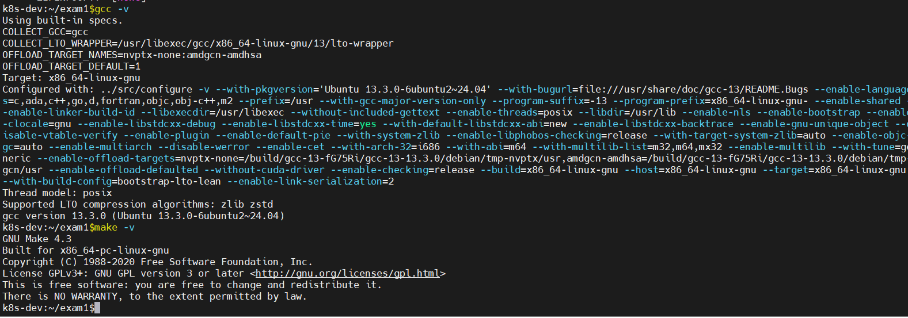
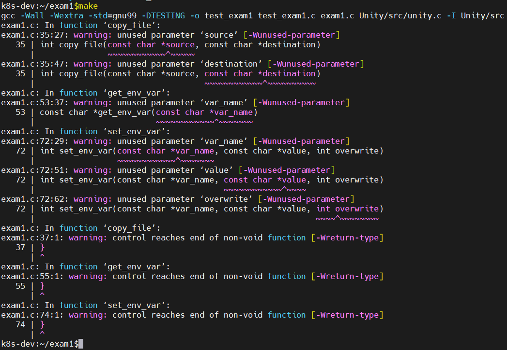
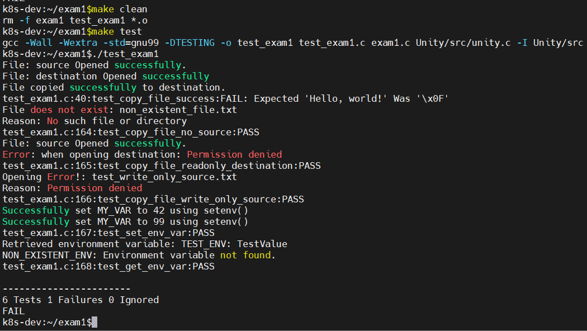
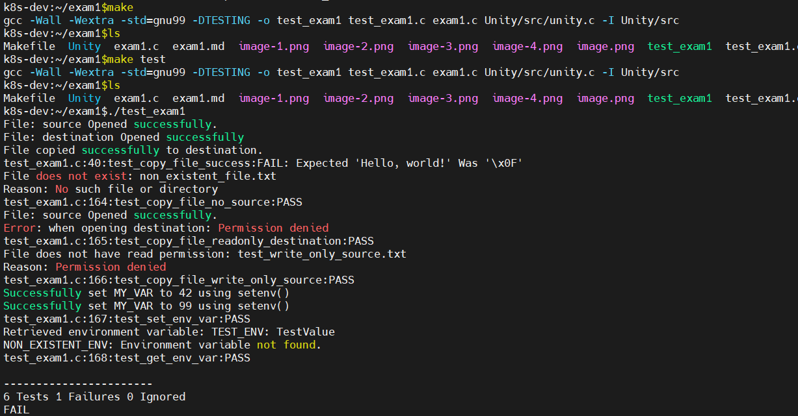

# EE-3233-01T-Summer 2025-Systems Programming for Engineers
## ----------------------------------------------------------------------------
# Assignment 2: Exam1 
## Name: **Arnav Gupta**
## Utsa abcID : **Enp615**


### Developer Machine Setup : vscode for c/c++ on ubuntu
=============================
- Install VSCode
- sudo apt update -y && sudo apt upgrade -y
- sudo apt install build-essential




##Execution steps









## Conclusion
I learnt hard way to compile code using make tools.

## Source Code 

```c
#include <stdio.h>
#include <stdlib.h>
#include <unistd.h>
#include <sys/types.h>
#include <sys/stat.h>
#include <fcntl.h>

#define BUFFER_SIZE 1024 // Define a constant for the buffer size

/**
 * Function: copy_file
 * -------------------
 * Copies the content from the source file to the destination file using system calls.
 *
 * Parameters:
 *    - source: The path of the source file (file to copy from).
 *    - destination: The path of the destination file (file to copy to).
 *
 * Write File Permissions: (Must use these file permissions)
 *  S_IRUSR: Owner has read permission.
 *  S_IWUSR: Owner has write permission.
 *  S_IRGRP: Group has read permission.
 *  S_IROTH: Others have read permission.
 *
 * Returns:
 *    0 on success
 *   -1 on failure (if an error occurs while opening, reading, or writing the files).
 *
 * System calls that MUST be used:
 *    - open(): Opens the source and destination files.
 *    - read(): Reads the content from the source file.
 *    - write(): Writes the content to the destination file.
 *    - close(): Closes the files after the operation.
 */
int copy_file(const char *source, const char *destination)
{

    // Check if file exists
    if (access(source, F_OK) != 0) {
        fprintf(stderr, "File does not exist: %s\n", source);
        perror("Reason");
        return -1;
    }

    // Check if file has read permission
    if (access(source, R_OK) != 0) {
        fprintf(stderr, "File does not have read permission: %s\n", source);
        perror("Reason");
        return -1;
    }    

    //open source_file in readonly mode, it will return a valid file descriptor.
    // int open(const char *pathname, int flags);
    int read_fd = open(source, O_RDONLY);
    if (read_fd == -1)
    {        
        fprintf(stderr, "Opening Error!: %s\n", source);
        perror("Reason");
        //perror("Error: when using opening source.");
        return -1;
    }
    else
    {
        printf("File: source Opened successfully.\n");
    }
    

    //open destination in 'write' mode.
    // "Open the file for writing. If it doesn’t exist, create it with permissions 664 (rw-rw-r--). If it already exists, truncate it.
    // int open(const char *pathname, int flags);
    int write_fd = open(destination, O_WRONLY | O_CREAT, S_IWUSR, O_TRUNC | S_IRUSR | S_IRGRP | S_IWGRP | S_IROTH );
    if (write_fd == -1)
    {
        perror("Error: when opening destination");
        return -1;
    }
    else
    {
        printf("File: destination Opened successfully\n");
    }


    //read 1024 bytes of data in one cycle
    char buffer[BUFFER_SIZE]; //already allocated a buffer of size 1024 bytes
    ssize_t bytes_read;

    //read will return > 0 as number of bytes it read, 0 as End of file, and -1 as error
    // it will read contents of file of size (buffer) into buffer.
    while ((bytes_read = read(read_fd, buffer, sizeof(buffer))) > 0) {
        if (write(write_fd, buffer, bytes_read) != bytes_read) {
            perror("Error writing to destination files");
            close(read_fd);
            close(write_fd);

            return -1;
        }
    }

    if (bytes_read == -1) {
        perror("Error reading from source file");
        return -1;
    } else {
        printf("File copied successfully to destination.\n");
    }

    // close 
    close(read_fd);
    close(write_fd);
    
    return 0;

}

/**
 * Function: get_env_var
 * ---------------------
 * Retrieves the value of an environment variable.
 *
 * Parameters:
 *    - var_name: The name of the environment variable to retrieve.
 *
 * Returns:
 *    - The value of the environment variable if it exists.
 *    - A message "Environment variable not found" if the variable is not found.
 *
 * This function uses the standard library function getenv() to get the value.
 */
const char *get_env_var(const char *var_name)
{
    char *env_var_val = getenv(var_name);
    if (env_var_val) {
        printf("Retrieved environment variable: %s: %s\n", var_name, env_var_val);
        return env_var_val;
    } else {
        printf("%s: Environment variable not found.\n", var_name);
        return "Environment variable not found";
    }
}    


/**
 * Function: set_env_var
 * ---------------------
 * Sets or updates the value of an environment variable.
 *
 * Parameters:
 *    - var_name: The name of the environment variable to set.
 *    - value: The value to assign to the environment variable.
 *    - overwrite: Determines whether to overwrite the variable if it already exists.
 *                 - 1 to overwrite, 0 to prevent overwriting.
 *
 * Returns:
 *    0 on success.
 *   -1 on failure (if setting the environment variable fails).
 */
int set_env_var(const char *var_name, const char *value, int overwrite)
{

    if (setenv(var_name, value, overwrite) != 0) {
        perror("Failed to set environment variable");
        return -1;
    } else {
        printf("Successfully set %s to %s using setenv()\n", var_name, getenv(var_name));
        return 0;
    } 
}

```