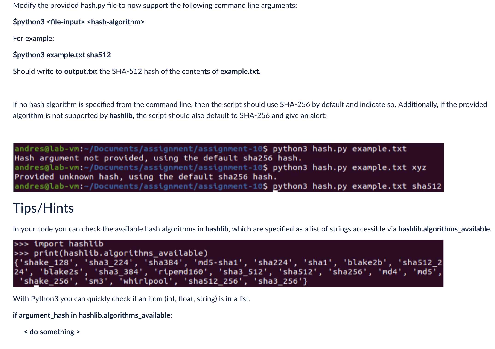

Lab Assignment 10 -Due Aug 4th@11:59 
Due: Mon Aug 4, 2025 11:59pmDue: Mon Aug 4, 2025 11:59pm
Ungraded, 10 Possible Points
10 Points Possible
Attempt

In Progress
NEXT UP: Submit Assignment

Unlimited Attempts Allowed
EE-3233

Systems Programming for Engineers

Teaching/Lab Assistant: Kriza Baby

kriza.baby@utsa.edu

 

LAB 10

hash.py Download hash.pyOpen this document with ReadSpeaker docReader

 

Modify the provided hash.py file to now support the following command line arguments:

$python3 <file-input> <hash-algorithm>

For example:

$python3 example.txt sha512

Should write to output.txt the SHA-512 hash of the contents of example.txt.

 

If no hash algorithm is specified from the command line, then the script should use SHA-256 by default and indicate so. Additionally, if the provided algorithm is not supported by hashlib, the script should also default to SHA-256 and give an alert:

 

image.png

Tips/Hints
In your code you can check the available hash algorithms in hashlib, which are specified as a list of strings accessible via hashlib.algorithms_available.

image.png

With Python3 you can quickly check if an item (int, float, string) is in a list.

if argument_hash in hashlib.algorithms_available:

      < do something >

 

Deliverables
You must upload the script with your solution, named with the following format:

<name-of-file>_<first-name>_<last-name>.py

For example:

example_andres_hernandez.py

Report-like submissions in PDF format will no longer be accepted.

Grading
Your solution will be evaluated with a script to check if your solution is correct.
Partial marks will be granted for cases where the output is partially correct.
Furthermore, following the syllabus, your script will be evaluated against MOSS (http://theory.stanford.edu/~aiken/moss/) to detect similar code.