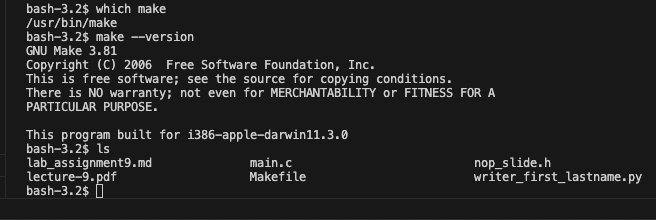

This asignment is on learning how to use make tool, to build, compile program uging make tool.

Lab Assignment 9 -Due July 28th @11:59 
Due: Mon Jul 28, 2025 11:59pmDue: Mon Jul 28, 2025 11:59pm
Ungraded, 10 Possible Points
10 Points Possible
Attempt
Attempt 1

In Progress
NEXT UP: Submit Assignment

Unlimited Attempts Allowed
 

EE-3233 Systems Programming for Engineers

Teaching/Lab Assistant: Kriza Baby                                                                                                                                                                                                  kriza.baby@utsa.edu

Lab Assignment 9

 

In this short assignment you will need to modify the provided writer.py file in such a way that itrandomly adds nop or fnop instructions to the nop_slide.S.The following files are provided:

•Makefile

•main.c

•nop_slide.h

•Writer.py

 

The files above must be in the same directory and for the purposes of this lab only the writer.py and the Makefile files need to be modified. You can decide where and how many nop or fnop assembly language instructions to add. In addition, make sure the python script produces the file nop_slide.S with the instructions added. For the Makefile, make sure that the rules have thedependency files and correct filename.

Before you compile the project, run command below to remove any testing files produced previously. User@vm:~/lab9/ $ make clean

Finally, you should be able to produce the nop_slide.S and the executable by running:User@vm:~/lab9/ $ make all

Expected Output With your new script, you should see an output like this (note that outputs will be different due to the nature of the assignment, in this screenshot, script selected 10 random nops and fnops):

image.png

Tips/Hints

You will need to use the random module. Fortunately, the module provides a lot of methods to make a random choice. It will be a good idea that you check the documentation of random, which you can find with a quick Google search. Note that there are multiple solutions to this assignment.

What is fnop and nop assembly language instruction?

When 8086 processor was introduced, it had only ALU (Arithmetic and Logic Unit) which can only do Integer operations. Assembly language instruction set used NOP (no operator) instruction to skip one cycle of 8086 processor with any real operations and move to the next instruction with the delay of that missed cycle. When 8087 processor was developed for Floating-point operations, FNOP (floating-point no operator) instruction was designed to skip one cycle or add one idle cycle to the instruction set. With modern processors which can process both integer and floating-point operations, both fnop and nop will skip one cycle of the processor or it will create a small delay in time to process the instruction set. Beyond timing, NOPs can also be used to prevent hazards, to occupy branch delay slots, or as placeholders in code development.Assuming core running at 400MHz, the time taken to execute 1 NOP or 1 FNOP instruction is 1/400 x 10^6 = 2.5 nano seconds. Evaluation Like in the lecture, your script will be used with a Makefile to compile an executable, so make surethat your script works properly.

 

•Points will be deducted if the file does not follow the deliverable format

 

Furthermore, following the syllabus, your script will be evaluated with Code Similarity Checker to detect plagiarism and/or collaboration.

 

Grading

• Your solution will be evaluated with a script to check if your solution is correct.

• Partial marks will be granted for cases where the output is partially correct

• No marks will be granted for submissions that does not compile or run

Deliverables You must upload only the python script and the Makefile you use to generate the executable, named with the following format: writer_<first-name>_<last-name>.py  &  Makefile_<first-name>_<last-name>

For example: writer_andres_hernandez.py

                        Makefile_andres_hernandez

Report-like submissions in PDF format will no longer be accepted.

 

nop_slide.hDownload nop_slide.hOpen this document with ReadSpeaker docReader

MakefileDownload MakefileOpen this document with ReadSpeaker docReader

main.cDownload main.cOpen this document with ReadSpeaker docReader

writer_first_lastname.py