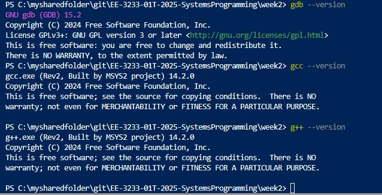
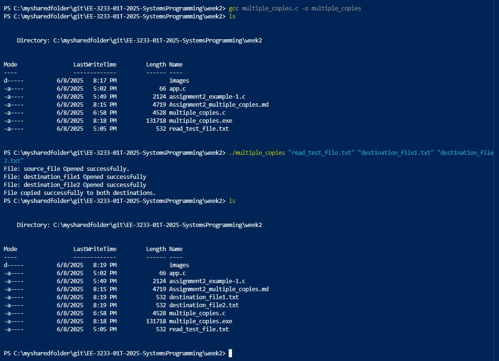
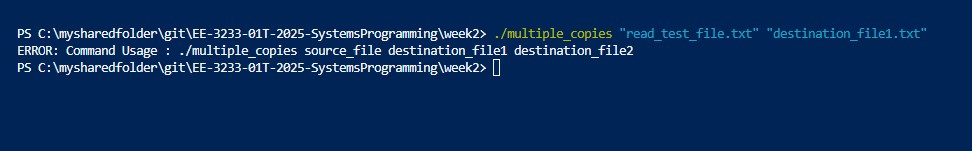
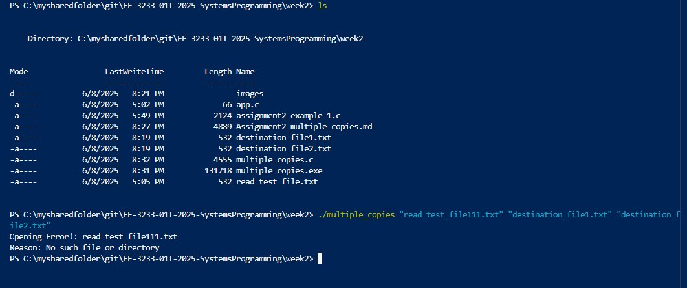
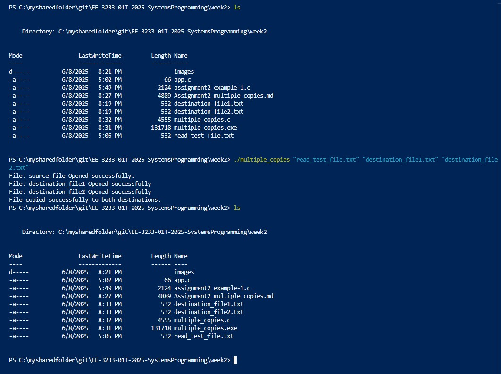
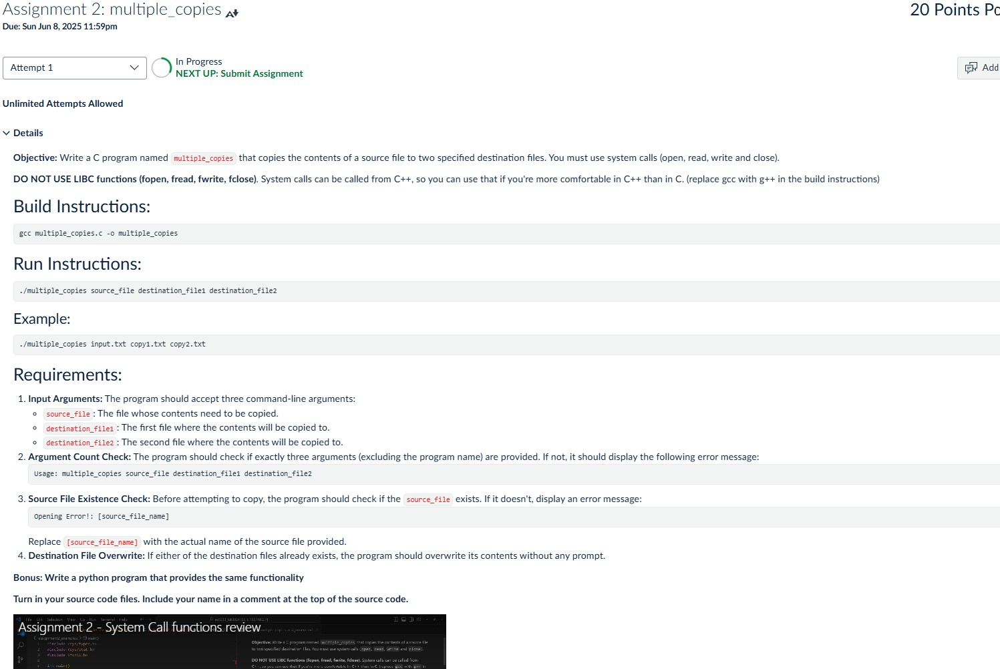

# EE-3233-01T-Summer 2025-Systems Programming for Engineers
## ----------------------------------------------------------------------------
# Assignment 2: multiple_copies
## Name: **Arnav Gupta**
## Utsa abcID : **Enp615**


### Developer Machine Setup : vscode for c/c++ on windows
=============================
- Install VSCode
- setup gcc, g++, gdb using https://code.visualstudio.com/docs/languages/cpp for windows (mingw tool chain, msys2 shell)
- Refer -> https://www.youtube.com/watch?v=DMWD7wfhgNY
  



## ----------------------------------------------------------------------------
**Abstract**: This lab is about writing a c program taking 3 arguments, and copies contents of one file to another two, using system calls to open, read, write.


| File                  | Description                     |
|-----------------------|---------------------------------|
| [multiple_copies.c](./multiple_copies.c) | Contains 'c' code to make two copies of a source file, using system calls open, read, write files after reading bytes as buffer


## Execution Steps

**Case 1: main functionality to copy contents of source file into two destination files**
1. Input Arguments: The program should accept three command-line arguments:
    - source_file: The file whose contents need to be copied.
    - destination_file1: The first file where the contents will be copied to.
    - destination_file2: The second file where the contents will be copied to.



**Case 2: Argument Count Check** The program should check if exactly three arguments (excluding the program name) are provided. If not, it should display the following error message:
    Usage: multiple_copies source_file destination_file1 destination_file2




**Case 3: Source File Existence Check** Before attempting to copy, the program should check if the source_file exists. If it doesn't, display an error message:
    Opening Error!: [source_file_name]




**Case 4: Destination File Overwrite** If either of the destination files already exists, the program should overwrite its contents without any prompt.




### Conclusion:
I have leant the flow of compiling and executing c code in VScode (an IDE environment). And most important I have learnt how commnads in Unix/Linux are getting created. How actuall cp command is programmed. This is good learning to practice development with actual tools.


## Source Code
<pre> ```c
// a C program named multiple_copies that copies the contents of a source file to two specified destination files. 
// using system calls (open, read, write and close).
// Build Instructions: gcc multiple_copies.c -o multiple_copies
// Run Instructions: ./multiple_copies source_file destination_file1 destination_file2
// Run Instructions: ./multiple_copies "read_test_file.txt" "destination_file1.txt" "destination_file2.txt"
// Example: /multiple_copies input.txt copy1.txt copy2.txt

/*
Requirements:
1. Input Arguments: The program should accept three command-line arguments:
    source_file: The file whose contents need to be copied.
    destination_file1: The first file where the contents will be copied to.
    destination_file2: The second file where the contents will be copied to.

2. Argument Count Check: The program should check if exactly three arguments (excluding the program name) are provided. If not, it should display the following error message:
    Usage: multiple_copies source_file destination_file1 destination_file2

3. Source File Existence Check: Before attempting to copy, the program should check if the source_file exists. If it doesn't, display an error message:
    Opening Error!: [source_file_name]
    Replace [source_file_name] with the actual name of the source file provided.

4. Destination File Overwrite: If either of the destination files already exists, the program should overwrite its contents without any prompt.
*/

#include &lt;sys/types.h&gt;
#include &lt;sys/stat.h&gt;
#include &lt;fcntl.h&gt;
#include &lt;errno.h&gt;
#include &lt;stdio.h&gt;
#include &lt;unistd.h&gt;

int main(int argc, char *argv[]) {
    //check count of arguments passed in command line, exit if less than 4.
    if (argc != 4) {
        fprintf(stderr, "ERROR: Command Usage : ./multiple_copies source_file destination_file1 destination_file2 \n");
        return 1;
    }

    // assign appropriate file names as per arguments passed.
    const char *source_file = argv[1];
    const char *destination_file1 = argv[2];
    const char *destination_file2 = argv[3];

    //open source_file in readonly mode, it will return a valid file descriptor.
    // int open(const char *pathname, int flags);
    int read_fd = open(source_file, O_RDONLY);
    if (read_fd == -1)
    {        
        fprintf(stderr, "Opening Error!: %s\n", source_file);
        perror("Reason");
        //perror("Error: when using opening source_file.");
        return 1;
    }
    else
    {
        printf("File: source_file Opened successfully.\n");
    }
    

    //open destination_file1 in 'write' mode.
    // "Open the file for writing. If it doesn’t exist, create it with permissions 664 (rw-rw-r--). If it already exists, truncate it.
    // int open(const char *pathname, int flags);
    int write_fd1 = open(destination_file1, O_WRONLY | O_CREAT, S_IWUSR, O_TRUNC | S_IRUSR | S_IRGRP | S_IWGRP | S_IROTH );
    if (write_fd1 == -1)
    {
        perror("Error: when opening destination_file1");
        return 1;
    }
    else
    {
        printf("File: destination_file1 Opened successfully\n");
    }


    //open destination_file2 in 'write' mode.
    // int open(const char *pathname, int flags);
    int write_fd2 = open(destination_file2, O_WRONLY | O_CREAT, S_IWUSR, O_TRUNC | S_IRUSR | S_IRGRP | S_IWGRP | S_IROTH );
    if (write_fd2 == -1)
    {
        perror("Error: when opening destination_file2");
        return 1;
    }
    else
    {
        printf("File: destination_file2 Opened successfully\n");
    }

    //read 1024 bytes of data in one cycle
    char buffer[1024]; //already allocated a buffer of size 1024 bytes
    ssize_t bytes_read;

    //read will return > 0 as number of bytes it read, 0 as End of file, and -1 as error
    // it will read contents of file of size (buffer) into buffer.
    while ((bytes_read = read(read_fd, buffer, sizeof(buffer))) > 0) {
        if (write(write_fd1, buffer, bytes_read) != bytes_read || write(write_fd2, buffer, bytes_read) != bytes_read) {
            perror("Error writing to destination files");
            close(read_fd);
            close(write_fd1);
            close(write_fd2);
            return 1;
        }
    }

    if (bytes_read == -1) {
        perror("Error reading from source file");
    } else {
        printf("File copied successfully to both destinations.\n");
    }

    // close 
    close(read_fd);
    close(write_fd1);
    close(write_fd2);
    return 0;
}


 ``` </pre>


## ----------------------------------------------------------------------------
## Annexure - Assignment Details
## ----------------------------------------------------------------------------


## Assignment 2: multiple_copies
Due: Sun Jun 8, 2025 11:59pmDue: Sun Jun 8, 2025 11:59pm
Ungraded, 20 Possible Points
20 Points Possible
Attempt
Attempt 1

In Progress
NEXT UP: Submit Assignment

Unlimited Attempts Allowed
Objective: Write a C program named multiple_copies that copies the contents of a source file to two specified destination files. You must use system calls (open, read, write and close).

DO NOT USE LIBC functions (fopen, fread, fwrite, fclose). System calls can be called from C++, so you can use that if you're more comfortable in C++ than in C. (replace gcc with g++ in the build instructions)

Build Instructions:
gcc multiple_copies.c -o multiple_copies
Run Instructions:
./multiple_copies source_file destination_file1 destination_file2
Example:
./multiple_copies input.txt copy1.txt copy2.txt
Requirements:
Input Arguments: The program should accept three command-line arguments:
source_file: The file whose contents need to be copied.
destination_file1: The first file where the contents will be copied to.
destination_file2: The second file where the contents will be copied to.
Argument Count Check: The program should check if exactly three arguments (excluding the program name) are provided. If not, it should display the following error message:
Usage: multiple_copies source_file destination_file1 destination_file2
Source File Existence Check: Before attempting to copy, the program should check if the source_file exists. If it doesn't, display an error message:
Opening Error!: [source_file_name]
Replace [source_file_name] with the actual name of the source file provided.
Destination File Overwrite: If either of the destination files already exists, the program should overwrite its contents without any prompt.
Bonus: Write a python program that provides the same functionality

Turn in your source code files. Include your name in a comment at the top of the source code.

